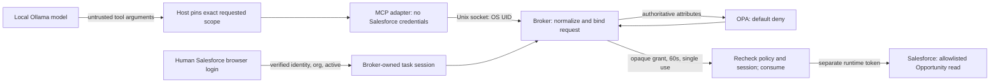

# AI Access Broker

Author: **Kehinde Bade**

This project tests how an agent can read Salesforce records through a broker that limits access to a specific task.

We do not want to rely on the agent's grant for trust. The broker authenticates the caller, checks the human's task scope, evaluates OPA policy, and provides restricted permission for the specific activity. It checks those conditions again when the agent redeems a short-lived grant. The broker holds the Salesforce credentials.

The enterprise flow is **Salesforce human login → local agent/Ollama → MCP → broker/OPA → integration-runtime Salesforce read**. The human identity authorizes the task. A separate runtime identity executes the allowed read.

The synthetic mode gives reviewers a way to test the same model, MCP, broker and policy flow without an org or credentials. It uses injected identities and mock records. The lab supports bounded Opportunity reads; it has no write tool or arbitrary SOQL endpoint.

## Design position

An agent should request an activity, not decide the authority it has to perform it. A Salesforce token can provide broad API access while the current task needs one record and two fields. The broker is where that broad execution permission is narrowed to a specific request.

There are three separate questions: who authenticated the human, which local workload is asking, and which identity executes the Salesforce call. Combining them in one bearer token makes it difficult to explain whose authority was checked. This lab keeps human authorization and runtime execution separate, and states the current workload-identity limit: Unix peer credentials prove the Mac user, not two independent agents under that user.

A grant is a reference to broker-owned authorization state. Possessing it is insufficient. The broker checks the same caller, request, human session and executor context, rechecks policy, and consumes the grant before reading. If policy changes or the session expires between authorization and redemption, the earlier decision does not remain valid.

## Security invariants

| Invariant | Enforcement | Evidence |
|---|---|---|
| Request arguments cannot establish identity or task authority | Verified human OAuth, OS peer identity and server-owned scope mapping | Injected spoofing tests and owner-run human authentication |
| A model cannot widen the operator's selected request | Host normalizes and compares exact record/action/fields/task/audience before MCP | Actual adversarial model request blocked before MCP |
| Human scope remains narrower than runtime API permission | OPA checks configured human/task/record scope; separate runtime token executes | Actual OPA four-way A/B tests; scripted live B allow/A deny |
| Old decisions cannot bypass current conditions | Fresh context and OPA evaluation at issuance and redemption | Policy-change, expiry and session-binding tests |
| One grant permits at most one downstream attempt | Atomic server-side consumption before the read | Concurrent redemption, replay and downstream-failure tests |
| Missing policy or identity fails closed | Strict decision/identity validation and no downstream call on denial | OPA outage/malformed, identity mismatch and deny-call tests |
| Credentials stay at the broker boundary | Private prompts and memory-only human/runtime tokens; MCP exposes read authorization/redemption | Source boundary review and injected runtime-only bearer tests |

The verified results are intentionally narrower than a production claim. The model, MCP and OPA integration runs use synthetic identities and mock Salesforce. The scripted live split read was tested separately. The complete model-driven and web-UI Salesforce path still needs private validation after configuration separation.

## Tradeoffs

I kept customer scope and record IDs in server-owned configuration so the first test is reproducible. This tests policy enforcement and decision revalidation; it does not establish dynamic customer ownership from Salesforce. Discovery would need an authoritative source, freshness rules and failure behavior before its attributes could safely drive authorization.

I chose short-lived, single-use opaque grants because the broker can revoke the usefulness of an earlier decision through current policy and session checks. This adds a second local round trip and in-memory state. Restart discards grants, and a downstream failure still consumes one. Those are deliberate recoverability and replay tradeoffs.

The human session has a 15-minute bound rather than continuous revocation polling. A human disabled at Salesforce after login can remain represented in the local session until expiry; runtime API rejection still fails closed. Immediate human revocation, independent workload authentication and production audit durability would require additional design. They are not solved by this demo.

## Start the local interactive demo

On this prepared Mac, Python, the MCP SDK, OPA and `llama3.2:3b` are already available:

```sh
.venv/bin/python -m broker_lab.web_demo
```

Open **http://127.0.0.1:8765**. Choose a synthetic customer session and requested deal; click **Run agent request**. The optional adversarial prompt asks the model to change scope. The page shows what the model requested, whether it passed the host scope check, the broker decision, OPA attributes and reasons, the returned data, downstream read count, and grant TTL and consumption. It never displays bearer tokens or grant handles. Ctrl-C stops the UI.

| Synthetic session | Request A | Request B |
|---|---|---|
| Customer A / AgentA / scope A | Allow | Deny |
| Customer B / AgentB / scope B | Deny | Allow |

**The synthetic customer selector injects a test identity.** It does not perform a Salesforce login. Synthetic `active` and executor `validated` values are injected test assumptions. Ollama, SDK MCP, native Unix peer identity, broker grants and OPA execute; Salesforce is mocked. A real model is nondeterministic, but the host and broker enforce deterministic access boundaries. No read occurs if the model declines to use a tool.

## Run the Salesforce integration

See [live Salesforce setup](docs/LIVE_SALESFORCE.md). On the local development Mac, the approved identifying configuration is preserved in ignored `.local/lab.json`; keys/secrets remain private terminal entries. Salesforce stays the central enterprise integration.

```sh
# Terminal 1: fresh private human login, then separate runtime credentials
.venv/bin/python -m broker_lab.user_login --approved-setup --executor runtime --socket .run/split.sock
# Terminal 2: model-driven live read after the broker is ready
.venv/bin/python -m broker_lab.ollama_host --socket .run/split.sock --model llama3.2:3b --record B
```

Optional user-run live UI, after privately authenticating the split broker:

```sh
.venv/bin/python -m broker_lab.web_demo --live-broker-socket .run/split.sock
```

Live UI mode disables the synthetic identity selector. It cannot authenticate/change the human or access credentials. It drives the actual model/MCP/broker read path. Live OPA reasons and trusted context are not exported by MCP, so live UI denials are generic and also cover expiry/unavailability. **Model-driven and live-UI Salesforce execution still need private validation.** The scripted split test returned CustomerB's B record and denied A. The model-driven integration checks recorded here used mock Salesforce.

## Architecture and trust boundaries



Two-step authorization issues a random opaque in-memory grant, then binds redemption to the caller, normalized target/action/fields/task/audience and human/executor context. Policy is reevaluated and the grant atomically consumed before the read. Requests never authenticate an agent name or human identity. The default grant TTL is 60 seconds. Human sessions expire after 15 minutes. Same-UID processes share the local session; this does not distinguish separate agents under one Mac login.

Policy is [broker.rego](policy/broker.rego), authoritative example data is [lab.example.json](examples/lab.example.json), and inputs are [request.schema.json](request.schema.json) and [pdp-input.schema.json](pdp-input.schema.json). Request structure is inspired by RFC 9396 authorization_details; no OAuth/RAR compliance is claimed. Customer membership and delegation scope are static server mappings, not dynamically discovered Salesforce ownership or Account relationships.

Read allowlist: `Id`, `Name`, `StageName`, `CloseDate`, `Amount`, `NextStep`. The CLI/UI demo requests only **Id and Name**. The adapter checks exact returned record ID and projects only requested fields. No writes are implemented. An isolated approval-preview prototype has injected identity tests only and is not exposed to the UI/MCP or a Salesforce executor.

## Verify and reproduce

```sh
.venv/bin/python scripts/check.py
# Explicit integration check: real installed model, real MCP/OPA, fake Salesforce
.venv/bin/python scripts/model_smoke.py
# One synthetic scenario; denial exits 1 intentionally
.venv/bin/python -m broker_lab.demo_runner --customer B --record A
```

See [verification evidence](docs/VERIFICATION.md), [threat model and limitations](docs/THREAT_MODEL.md), [dependencies](docs/DEPENDENCIES.md) and [release preparation](docs/RELEASE.md). No software/model installation or download happens during these commands. Missing OPA/SDK/model fails or skips dependency-specific tests; `scripts/check.py` refuses missing OPA/SDK rather than claiming integration passed.

[Official Ollama chat API](https://docs.ollama.com/api/chat), [OPA policy language](https://www.openpolicyagent.org/docs/policy-language), [official MCP Python SDK](https://github.com/modelcontextprotocol/python-sdk).

## Hosted synthetic demo

The [hosted demo](https://ai-access-broker-demo.onrender.com) uses temporary server-issued Customer A/B identities, Gemini manual tool proposals, the real broker and OPA, and synthetic records. Gemini was enabled on the deployed instance on 2026-10-04. Source configuration remains disabled by default until the operator explicitly opts in. This hosted path has no MCP transport, Ollama, Salesforce connection or real-person authentication; those belong to the separate local flow above. Scripted broker/OPA tests remain available without Gemini.

### Verified hosted results, 2026-10-04

| Temporary session | Requested record | Live broker result | Synthetic reads |
|---|---|---|---|
| Customer A | A | Allow, correct A record | 1 |
| Customer A | B | Deny | 0 |
| Customer B | A | Deny | 0 |
| Customer B | B | Allow, correct B record | 1 |

The live prompt-override run returned `no_tool_call`: the broker was not evaluated, no model text was exposed, and no record was read. This does **not** prove that the broker blocked an override tool call. Offline injected-provider tests verify the host binding and broker boundaries independently of nondeterministic model behavior.

All 133 offline tests and actual installed OPA checks passed for the diagnostic update. Live stale-tab testing returned `page_out_of_sync` with zero model API attempts. The UI now explains session expiry, stale pages, rate limits, exhausted visitor budgets and busy execution separately.

### Current run limits

The demo permits **20 reserved Gemini runs per rolling 24 hours per server process**, and four per minute. Each run makes at most two provider requests, so that is at most 40 attempts in that process/window. A run can consume its reservation even when the provider fails or makes no tool call; this is not a guarantee of 20 successful reads.

Each visitor gets three model runs per minute and four during an absolute 15-minute visitor lifetime. A task lasts at most five minutes, bounded by visitor expiry. Reloading, starting a task or switching A/B does not reset that visitor budget or extend its lifetime. All budget/session state is in memory; restarting loses it. These are application safeguards, not a durable billing cap or Google's free-tier quota. The actual provider allowance depends on the project's model access, request/token limits and tier, and has not been verified here.

See [Gemini flow, evidence and limits](docs/GEMINI_DEMO.md) and [Render preparation](docs/RENDER_DEPLOYMENT.md). These verified hosted results do not validate the complete live Salesforce/model/MCP path.
